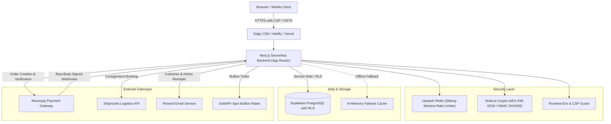
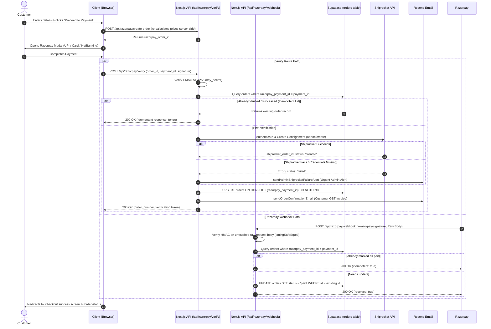
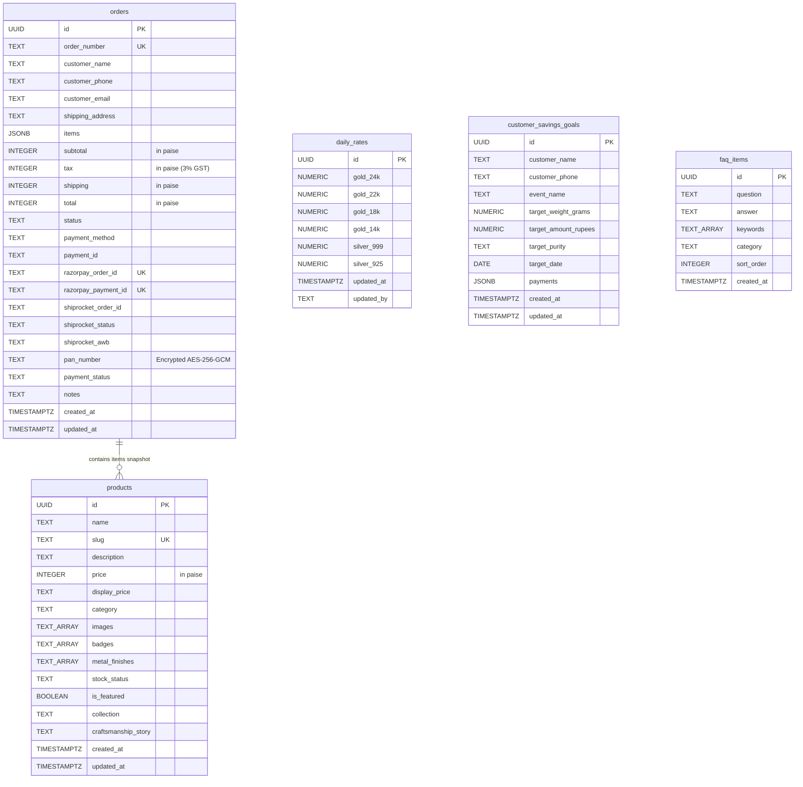

# Ambika Jewels — Project Overview & Architecture Guide

Welcome to the central documentation for the **Ambika Jewels** digital commerce and showroom operations platform. This document is divided into two distinct sections:

* **[Part A — Non-Coder Guide](#part-a--non-coder-plain-english-guide)**: Written in clear, non-technical English for store owners, business managers, sales executives, and non-technical staff.
* **[Part B — Developer & Technical Architecture](#part-b--developer--technical-architecture)**: Written for software engineers, devops personnel, and technical auditors, containing folder breakdowns, Mermaid diagrams, API references, environment configurations, and deployment procedures.

---

# Part A — Non-Coder (Plain-English Guide)

## 1. What the Website Does
Ambika Jewels is a modern e-commerce website and digital showroom counter built for a heritage fine jewelry house located in Jammu, India. It enables customers across India to browse authentic hallmarked gold, diamond, and sterling silver jewelry, calculate transparent precious metal pricing in real-time, safely pay online through Indian payment methods (UPI, debit cards, credit cards, net banking), and track their insured parcel until it arrives at their door. For showroom staff, it doubles as an in-store counter portal to track live Jammu bullion rates, compute digital GST tax invoices with instant thermal receipt printing, and manage monthly customer gold savings programs.

---

## 2. Customer Journey: From Browsing to Delivery

```
[ Browse Catalog ] ──> [ Add to Cart ] ──> [ Checkout Details ] ──> [ Razorpay Payment ]
         │                                                                   │
         ▼                                                                   ▼
[ Live Consignment Tracking ] <── [ Courier Dispatch ] <── [ Order Confirmation & Tax Receipt ]
```

1. **Browse**: The customer explores curated collections (Dogra Traditional heritage jewelry, Bridal Kundan sets, modern 18K/14K daily wear, and 925 sterling silver). Every product displays live transparent pricing, purity stamps (e.g. 22K 916), and BIS hallmark licensing notices.
2. **Cart**: Customers select items, specify metal finish preferences (Yellow Gold, Rose Gold, White Rhodium), review their total, and see an automated breakdown of the 3% statutory precious metals GST. Customers can also choose to inquire directly via WhatsApp with their bag contents pre-filled.
3. **Checkout**: The shopper provides their name, verified Indian delivery address, phone number, and email. If an order exceeds ₹2,00,000, Government of India regulations (CBDT Rule 114B) require a customer PAN card number; the site collects this and securely locks it in encrypted storage without exposing it to third parties.
4. **Pay**: The shopper clicks "Proceed to Secure Payment". A certified Razorpay payment window opens supporting Google Pay, PhonePe, Paytm, BHIM UPI, credit/debit cards, and major Indian net banking portals.
5. **Confirmation**: Once payment is approved, the customer immediately sees a verified confirmation page and receives an official GST tax receipt and order confirmation email with an unguessable access key.
6. **Shipping**: Behind the scenes, the system connects directly to Shiprocket logistics to automatically register the consignment with parcel dimensions and weight.
7. **Tracking**: The customer can visit the `/track` page at any time to monitor dispatch milestones (Quality Inspection, Serialized Tamper-Evident Packing, In-Transit Courier Waybill, Out for Delivery). To protect privacy, delivery addresses are masked (e.g., `H. No. 1***, G*** Nagar, Jammu - 180004`).

---

## 3. Owner & Admin Journey: What the Admin Panel Can Do

Showroom staff and store owners access the internal suite via `/admin` protected by an administrative passcode and time-limited secure session cookies.

* **In-Store Billing POS Counter (`/admin/counter`)**:
  * **Digital Billing & Calculator**: Cashiers enter item weights, gold purity, making charges per gram or percentage, and optional discounts. The system instantly computes gross amount, net bullion price, 3% GST, and grand total.
  * **Thermal Receipt Printer**: One click produces an 80mm/58mm POS thermal receipt format suitable for receipt printers (featuring business GSTIN, BIS Hallmark HUID notice, itemized weights, and customer copy).
  * **Daily Jammu Bullion Rate Manager**: Staff update showroom selling rates for 24K, 22K, 18K, 14K gold and 999/925 silver with a timestamp. These rates synchronize across the online store and counter calculators.
  * **Customer Savings Scheme Tracker**: Staff enroll customers into monthly gold savings plans (e.g., bridal accumulation goals), recording each cash or UPI installment and calculating accumulated gold weight based on that day's rate.
* **Order & Consignment Oversight**:
  * Review all incoming online web orders, payment statuses, and courier waybills.
  * Receive real-time red-alert emails if a payment cleared but courier parcel generation experienced an issue, allowing the showroom manager to intervene immediately.

---

## 4. Third-Party Services: Roles & Disaster Fallbacks

| Service | Primary Role | What Happens If It Goes Down? |
| :--- | :--- | :--- |
| **Razorpay** | Processes customer payments (UPI, Cards, Net Banking) and verifies payment authenticity. | The customer cannot complete checkout online. The site displays a helpful error message inviting the customer to click "Order via WhatsApp" to reserve the piece offline. |
| **Shiprocket** | Generates automated domestic courier waybills, schedules showroom pickup, and tracks deliveries. | The payment still succeeds safely. The order is recorded in the store database, and the system **immediately emails an urgent alert to the showroom owner** with the customer's phone number and order details so staff can manually book the parcel on the Shiprocket website. |
| **Supabase (PostgreSQL)** | Central cloud database storing orders, catalog listings, daily bullion rates, and customer savings schemes. | The website gracefully falls back to local product catalogs and cached rates. Orders placed during downtime are captured via customer confirmation tokens and email receipts so sales records are never lost. |
| **Resend** | Sends automated transactional emails (GST invoices, confirmation receipts, and admin emergency alerts). | Checkout completes normally without interruption. Email dispatch errors are logged in the server console, and the customer can still view and print their receipt directly on the `/order-status` page. |
| **Upstash Redis** | Shared lightning-fast memory store that blocks hackers, malicious bots, and brute-force password guessing. | If Upstash is offline or unconfigured, the application automatically falls back to internal server memory rate limiting so genuine customers can continue using the site without disruption. |
| **GoldAPI** | Fetches live market wholesale silver and precious metal spot prices. | If the external market API fails or times out, the application automatically uses the store's verified Jammu counter rate saved in the database or config. |

---

## 5. Glossary of Terms

* **BIS Hallmark**: Bureau of Indian Standards certification guaranteeing the exact purity of gold jewelry (e.g., 916 for 22 Karat).
* **HUID**: Hallmark Unique Identification, a 6-character alphanumeric code laser-engraved onto every authentic gold piece in India.
* **PAISE**: The smallest unit of Indian currency (₹1 = 100 paise). The website calculates all financial transactions in paise internally to eliminate floating-point rounding errors.
* **CBDT Rule 114B**: Central Board of Direct Taxes statutory regulation requiring collection of customer PAN details on precious metal transactions exceeding ₹2,00,000.
* **Idempotency**: An engineering safety guarantee ensuring that if a customer accidentally clicks "Pay" twice or a network retries a webhook, the store will **never** charge twice, duplicate the order, or book two courier pickups.
* **Rate Limiting**: An automated safety net that restricts how many times a computer or phone can attempt actions (such as logging in or querying orders) within a minute, preventing bot attacks.
* **IDOR Protection**: Security measures that prevent internet users from guessing another customer's order number to snoop on their address, phone number, or purchase history.

---

# Part B — Developer & Technical Architecture

## 1. Project Folder Structure

```
Ambika Jewels/
├── docs/                                # Project documentation & visual assets
│   ├── PROJECT_OVERVIEW.md              # Master project overview & architectural manual
│   └── dependency-graph.svg             # Madge module dependency graph
├── public/                              # Static public assets, favicons, logos
├── scripts/                             # Operational & maintenance scripts
│   └── generate-dependency-graph.mjs    # Wasm-based madge-to-SVG graph compiler
├── src/
│   ├── app/                             # Next.js App Router (pages & REST API endpoints)
│   │   ├── (storefront pages)           # Public customer pages (home, about, collections, cart, etc.)
│   │   ├── admin/                       # Protected admin console and in-store counter POS
│   │   └── api/                         # Backend REST API endpoints
│   ├── components/                      # Modular UI components
│   │   ├── catalog/                     # Product cards, detail modals, filters
│   │   ├── counter/                     # Billing POS, rate tickers, savings tracker, thermal receipts
│   │   ├── home/                        # Hero, testimonials, category grids, trust badges
│   │   ├── layout/                      # Global header, footer, bottom navigation
│   │   └── ui/                          # Reusable UI primitives and dividers
│   ├── config/                          # Business constants, contact info, and legal configurations
│   ├── context/                         # Client-side React context (CartContext)
│   ├── data/                            # Static product catalog and store knowledge fallback data
│   ├── lib/                             # Core server utilities, security engines, and DB clients
│   ├── types/                           # TypeScript interfaces and domain models
│   └── utils/                           # Formatting, WhatsApp link generators, and string helpers
├── supabase/                            # Database definitions & migrations
│   ├── schema.sql                       # Complete baseline PostgreSQL schema with RLS policies
│   └── migrations/                      # Idempotent incremental SQL migrations
├── next.config.ts                       # Next.js configuration, security headers, CSP
├── package.json                         # Project dependencies and script declarations
└── tsconfig.json                        # TypeScript path mappings (@/*) and compiler configuration
```

### Key Files at a Glance
* [`src/config/siteConfig.ts`](file:///d:/Client%20Projects/Ambika%20Jewels/src/config/siteConfig.ts): Single source of truth for business name, GSTIN, BIS license number, address, phone, and policy values.
* [`src/lib/rateLimit.ts`](file:///d:/Client%20Projects/Ambika%20Jewels/src/lib/rateLimit.ts): Central Upstash Redis sliding-window distributed rate limiter.
* [`src/lib/encryption.ts`](file:///d:/Client%20Projects/Ambika%20Jewels/src/lib/encryption.ts): AES-256-GCM encryption for PAN data, cryptographic HMAC token generator for order verification, and address masking.
* [`src/lib/supabaseAdmin.ts`](file:///d:/Client%20Projects/Ambika%20Jewels/src/lib/supabaseAdmin.ts): Privileged server-only Supabase client using `SUPABASE_SERVICE_ROLE_KEY` (never bundled in browser).
* [`src/lib/supabase.ts`](file:///d:/Client%20Projects/Ambika%20Jewels/src/lib/supabase.ts): Public Supabase client using `NEXT_PUBLIC_SUPABASE_ANON_KEY` subject to Row Level Security.
* [`src/lib/email.ts`](file:///d:/Client%20Projects/Ambika%20Jewels/src/lib/email.ts): Resend email dispatchers for order confirmations and admin Shiprocket failure alerts.
* [`src/lib/env.ts`](file:///d:/Client%20Projects/Ambika%20Jewels/src/lib/env.ts): Startup environment validation enforcing strict fail-loud behavior in production.
* [`next.config.ts`](file:///d:/Client%20Projects/Ambika%20Jewels/next.config.ts): HTTP security headers (CSP, HSTS, X-Frame-Options, X-Content-Type-Options).

---

## 2. Mermaid Diagrams

### (1) System Architecture



---

### (2) Checkout & Payment Sequence Diagram (Verify + Webhook + Idempotency)



---

### (3) Database Entity-Relationship (ER) Diagram



---

### (4) Application Routes & API Endpoints

#### Storefront Pages
* `/`: Homepage featuring dynamic hero banners, jewelry categories, heritage craftsmanship narrative, best sellers, and BIS hallmark trust indicators.
* `/collections`: Catalog browser with category filters (Gold, Diamonds, Silver, Dogra Heritage) and budget sort.
* `/collections/[slug]`: Product details page displaying HUID hallmarking details, purity badges, metal finish selector, making charge transparency, and live WhatsApp inquiry.
* `/cart`: Shopping cart summary with GST calculation, free shipping thresholds, and order notes.
* `/checkout`: Single-page checkout collecting verified delivery address, conditional PAN entry (>₹2,00,000), and Razorpay checkout launcher.
* `/order-status`: Detailed tax invoice review, download option, and courier delivery progress.
* `/track`: Privacy-guarded parcel tracking requiring Order Reference plus customer Phone, Email, or secure access token.
* `/services`, `/tools`, `/about`, `/contact`: Showroom brand pages, bespoke jewelry consultation, store directions, and opening hours.
* `/privacy-policy`, `/terms`, `/refund-policy`, `/shipping-policy`: E-commerce legal policies compliant with Indian Consumer Protection (E-Commerce) Rules and Razorpay/Shiprocket merchant guidelines.

#### Admin Pages
* `/admin/login`: Secure credential gateway with rate-limiting protection.
* `/admin`: Overview console for store orders and inventory status.
* `/admin/counter`: Point-of-Sale (POS) counter billing terminal, thermal receipt printing engine, live Jammu bullion rate updater, and savings program manager.

#### REST API Endpoints
* `POST /api/razorpay/create-order`: Calculates order total securely from server catalog prices and registers an order with Razorpay.
* `POST /api/razorpay/verify`: Validates payment signatures, performs database idempotency checks, registers shipments with Shiprocket, and sends email receipts.
* `POST /api/razorpay/webhook`: Validates raw-body webhook signatures from Razorpay to guarantee idempotent payment status reconciliation.
* `GET /api/track`: Retrieves order and courier transit stages; masks addresses and enforces IDOR verification.
* `POST /api/chat`: AI jewelry concierge powered by Groq LLM with store knowledge grounding and Upstash rate limiting.
* `POST /api/orders`: Submits guest orders for direct WhatsApp confirmations.
* `GET /api/silver/price`: Returns wholesale bullion rates from GoldAPI with local database fallback.
* `POST /api/admin/login`: Verifies admin passcode via constant-time comparison and sets an `HttpOnly` session cookie.
* `GET /api/admin/check-auth`: Verifies the active admin session token.
* `POST /api/admin/logout`: Clears the admin session cookie.

---

## 3. Environment Variables Reference

| Variable Name | Client / Server | Purpose |
| :--- | :--- | :--- |
| `NEXT_PUBLIC_RAZORPAY_KEY_ID` | Client & Server | Public Key ID from Razorpay Dashboard used by client checkout modal. |
| `RAZORPAY_KEY_SECRET` | Server Only | Secret Key from Razorpay Dashboard for signature verification and order creation. |
| `RAZORPAY_WEBHOOK_SECRET` | Server Only | Webhook secret configured in Razorpay dashboard for raw-body HMAC verification. |
| `ADMIN_PASSCODE` | Server Only | Showroom administrator passcode (minimum 6 characters). |
| `ADMIN_SESSION_SECRET` | Server Only | High-entropy secret used to cryptographically sign admin session tokens. |
| `ENCRYPTION_SECRET` | Server Only | 256-bit encryption key used to encrypt customer PAN numbers (AES-256-GCM). |
| `NEXT_PUBLIC_SUPABASE_URL` | Client & Server | Supabase project API gateway URL. |
| `NEXT_PUBLIC_SUPABASE_ANON_KEY` | Client & Server | Public anonymous client key constrained by Supabase Row Level Security. |
| `SUPABASE_SERVICE_ROLE_KEY` | Server Only | Privileged server-only Supabase key for administrative and payment updates. |
| `UPSTASH_REDIS_REST_URL` | Server Only | Upstash Redis REST endpoint for distributed rate limiting. |
| `UPSTASH_REDIS_REST_TOKEN` | Server Only | Upstash Redis REST authentication token. |
| `SHIPROCKET_EMAIL` | Server Only | Registered account email for Shiprocket external API authentication. |
| `SHIPROCKET_PASSWORD` | Server Only | Account password for Shiprocket external API authentication. |
| `SHIPROCKET_PICKUP_LOCATION` | Server Only | Pickup location nickname configured in Shiprocket dashboard (defaults to 'Primary'). |
| `RESEND_API_KEY` | Server Only | Resend API key for dispatching order confirmation and alert emails. |
| `RESEND_FROM_EMAIL` | Server Only | Verified domain email sender (e.g., `Ambika Jewels <orders@ambikajewelsshop.com>`). |
| `ADMIN_ALERT_EMAIL` | Server Only | Destination email address for emergency Shiprocket dispatch alerts. |
| `GROQ_API_KEY` | Server Only | API key for the AI shopping assistant LLM. |
| `GOLDAPI_KEY` | Server Only | Optional API key for live goldapi.io spot bullion feeds. |

---

## 4. Run, Build & Deployment Guide

### Local Development
```bash
# 1. Install dependencies
npm install

# 2. Copy and configure environment variables
cp .env.example .env.local
# (Edit .env.local with your test credentials)

# 3. Start development server
npm run dev
# Open http://localhost:3000
```

### Production Build & Linting
```bash
# Run ESLint validation
npm run lint

# Compile Next.js production build (Turbopack)
npm run build

# Start local production server
npm run start
```

### Database Deployment
1. Log into your [Supabase Dashboard](https://supabase.com).
2. Open the **SQL Editor**.
3. Run `supabase/schema.sql` to establish the baseline schema.
4. Run `supabase/migrations/20261001_idempotent_orders.sql` to apply the unique payment constraints and hardened RLS policies.

### Cloud Deployment (Netlify / Vercel)
1. Link your Git repository to Netlify or Vercel.
2. In the deployment dashboard, configure all variables from the [Environment Variables](#3-environment-variables-reference) table.
3. Configure the build command: `npm run build` with output directory `.next`.
4. Add the Webhook URL in your Razorpay Dashboard: `https://yourdomain.com/api/razorpay/webhook`, subscribing to `payment.captured` and `payment.failed`.

---

## 5. Security Measures & Known Limitations

### Security Measures Implemented
* **Zero Hardcoded Secrets**: All cryptographic keys, API tokens, and credentials are read strictly from environment variables; missing production keys trigger immediate fatal errors.
* **Server-Only Service Role Key**: `SUPABASE_SERVICE_ROLE_KEY` is completely isolated from client bundles (no `NEXT_PUBLIC_` prefix) and accessed only within protected server routes.
* **Row Level Security (RLS)**: Public client access to `orders` and `daily_rates` write operations is blocked at the database engine level.
* **Raw-Body Webhook Verification**: Razorpay webhook signatures are computed over the untouched raw request string and verified using `crypto.timingSafeEqual`.
* **Idempotent State Management**: Dual-layer deduplication (in-memory fast cache + database unique constraints) prevents duplicate order records and double courier bookings.
* **Content Security Policy (CSP)**: Explicit directives restrict frame ancestors, scripts, and outbound network connections to certified payment and cloud services.
* **PII & CBDT Rule 114B Compliance**: Customer PAN numbers are encrypted using AES-256-GCM before storage; raw PAN strings are excluded from server logs and third-party notes.
* **Distributed Sliding-Window Rate Limiting**: Upstash Redis limits bot abuse on authentication (5 attempts / 15 min), order placement, AI chat, and tracking endpoints.
* **Anti-IDOR Tracking**: Order lookups require the order ID plus customer phone, email, or a cryptographically signed HMAC access token.

### Known Limitations & Planned Enhancements
* **Multi-Location Inventory**: Currently, inventory tracking uses global stock states (`in_stock`, `limited`, `out_of_stock`). Multi-warehouse stock reservations can be integrated in future phases.
* **Automated Webhook Return Logistics**: Returns and exchanges are handled manually by customer service over WhatsApp/Phone in accordance with the Return Policy. Automated reverse-pickup generation via Shiprocket API can be added as shipping volume grows.
* **International Currency Switcher**: Payments are processed in INR (Indian Rupees) in accordance with domestic Indian bullion regulations. Multi-currency export support will require export-code compliance and international payment gateways.
